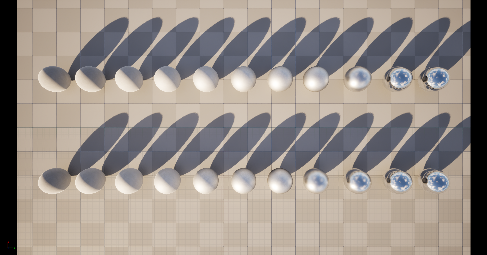
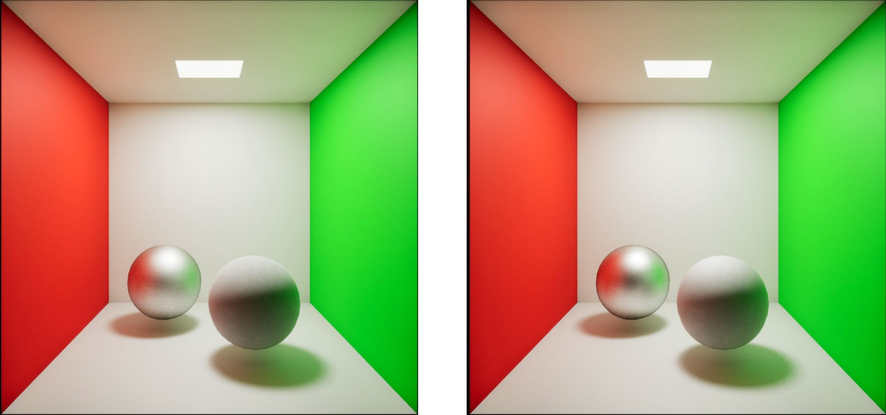

# Kulla–Conty multi-scattering BRDF in Unreal Engine 5

[](https://github.com/ZihanWG/KullaContyBRDF/actions/workflows/lut-validation.yml)
[](https://github.com/ZihanWG/KullaContyBRDF/actions/workflows/shader-validation.yml)
[](https://github.com/ZihanWG/KullaContyBRDF/actions/workflows/tool-tests.yml)

An experimental real-time implementation of Kulla–Conty energy compensation
for isotropic GGX materials. The project precomputes directional albedo LUTs on
the CPU, evaluates a multiple-scattering BRDF term at runtime, and compares it
with a single-scattering GGX baseline in controlled UE5 scenes.

**Release status:** research preview. The portable validation tools are covered
by CI; the UE 5.8.1 source patch still requires its first clean source-engine
build, measured GPU run and independent-reference image comparison.





These are presentation contact sheets, not quantitative inputs. New validation
captures use separate pixel-aligned linear files and the documented
[image-space protocol](Docs/IMAGE_VALIDATION.md).

## Why this project exists

A conventional microfacet BRDF accounts for paths that reflect from one
microfacet and then leave the surface. At higher roughness, masking and
shadowing cause some energy to remain inside the microfacet layer. Ignoring
subsequent bounces makes the material lose energy and can darken rough specular
reflection.

Kulla and Conty approximate those higher-order paths with an additional lobe:

```text
f = f_single + f_multi

          (1 - E(NoV)) (1 - E(NoL))
f_multi = --------------------------- * F_ms
                 pi (1 - E_avg)
```

`E(mu)` is the directional albedo of the GGX BRDF with Fresnel set to one, and
`E_avg` is its cosine-weighted hemispherical average. `F_ms` accounts for
Fresnel absorption over repeated bounces.

## What is implemented

- CPU Monte Carlo integration using a Hammersley sequence
- Heitz GGX visible-normal (VNDF) importance sampling
- Exact separable Smith GGX masking-shadowing
- `E(NdotX, roughness)` directional-albedo LUT
- `E_avg(roughness)` cosine-weighted average LUT
- Optional Schlick split-sum A/B LUT
- Automated white-furnace, colored-energy and `E_avg` quadrature validation
- Linear HDR/PNG image metrics with ROI, absolute and signed difference output
- UE-ready 16-bit linear PNG, Radiance HDR and unquantized PFM output
- Complete light- and view-dependent Kulla–Conty reference HLSL
- UE 5.8.1 source-engine patch with a selectable `Kulla-Conty` shading model
- UE 5.8.1 fast `E_avg` path derived and validated from the official Engine LUT
- UE5 roughness-row and Cornell-box evaluation scenes
- Controlled Nanite, Virtual Shadow Map and Lumen learning labs

The project distinguishes a controlled BRDF experiment from an experimental
source-engine shading-model integration. A regular Default Lit Custom Expression
does not replace UE's internal BRDF; see [the UE5 integration guide](Docs/UE5_INTEGRATION.md)
for both paths.

## Compatibility

| Component | Supported/tested scope | Status |
| --- | --- | --- |
| LUT generator and image comparison | Windows/MSVC and Linux/GCC, C++17 | CI validated |
| Isolated `E_avg` shader helper | Windows FXC/SM5 and DXC/SM6 | CI validated |
| UE source shading model | UE 5.8.1, Windows desktop, SM5/SM6, non-Substrate | Build pending |
| Forward/deferred/clustered direct lighting | UE 5.8.1 legacy shading-model path | Implemented, runtime evidence pending |
| Substrate, mobile, anisotropy, path tracing | Not supported | Out of scope |

## Repository layout

```text
Config/                         UE project configuration
Content/                        Test maps, materials and imported LUT assets
Docs/UE5_INTEGRATION.md         Material setup and evaluation protocol
Docs/VALIDATION.md              Numerical test method and reference results
Docs/IMAGE_VALIDATION.md        Pixel-aligned capture and difference protocol
Docs/UE5_RENDERING_LABS.md      Nanite, VSM and Lumen guided experiments
Docs/LICENSING.md               Project, Unreal Engine and asset license boundary
Docs/RELEASE_CHECKLIST.md       Public-release evidence and provenance gates
EnginePatch/UE5.8.1/            Source-engine shading model and installer
LUT/LUT/LUT.cpp                 Reproducible LUT generator
LUT/Compare/Compare.cpp         HDR/PNG image-space comparison tool
LUT/CMakeLists.txt              Portable generator build
Shaders/KullaContyBRDF.hlsl     Reference GGX + Kulla–Conty implementation
Tools/ExportUEEnergyLUT.py      Export UE's official energy LUT to EXR
Tools/AnalyzeUEEnergyLUT.py     Validate and rank engine-side E_avg fast paths
Tools/SummarizeUECsvProfile.py  Summarize paired Unreal GPU CSV captures
Tools/Tests/                    Regression tests for validation/reporting tools
EnginePatch/UE5.8.1/Test-EAvgShader.ps1  Compile/disassemble SM5 and SM6 fast paths
EnginePatch/UE5.8.1/Benchmark-EAvgModes.ps1  Run counterbalanced GPU A/B captures
ASSET_PROVENANCE.md             Origin and redistribution status of committed assets
THIRD_PARTY_NOTICES.md          Third-party code and Unreal Engine notices
KC.uproject                     Unreal Engine project
```

## Build and generate the LUTs

The generator requires a C++17 compiler and CMake. Visual Studio, Ninja and
Unix Makefiles are supported through the normal CMake generator selection:

```text
cmake -S LUT -B LUT/build
cmake --build LUT/build --config Release
```

Generate the reference 256×256 textures with 1,024 samples per texel:

```text
KullaContyLUTGenerator --size 256 --samples 1024 --output LUT/Generated
```

For a fast smoke test:

```text
KullaContyLUTGenerator --size 16 --samples 64 --output LUT/Generated
```

Generated files:

| Output | Purpose |
| --- | --- |
| `E_mu.png` | 16-bit runtime directional albedo sampled with `(NdotX, roughness)` |
| `E_avg.png` | 16-bit runtime average albedo sampled with roughness |
| `BRDF_SplitSum.png` | Optional 16-bit A/B split-sum reference |
| `*.hdr` | Linear Radiance-HDR alternatives |
| `*.pfm` | Full-float validation data |
| `*_preview.png` | Human-readable 8-bit previews only |
| `metadata.json` | Parameters, conventions and numerical ranges |
| `validation.json` | White-furnace, colored-energy and quadrature error report |

Using texel centers avoids the `NdotX = 0` singularity. Both generator and HLSL
use perceptual roughness with `alpha = roughness²`.

## Numerical validation

The generator now fails when its numerical checks exceed declared tolerances.
For the reference 256×256 LUT with 1,024 samples per texel:

| Metric | Result |
| --- | ---: |
| White-furnace maximum absolute error | 0.0002363713 |
| White-furnace RMS error | 0.0000039344 |
| Four-point `E_avg` maximum absolute error | 0.0006462380 |
| Four-point `E_avg` RMS error | 0.0001741692 |
| Maximum tested colored directional albedo | 0.9510494811 |

All checks pass. The white-furnace domain begins at roughness and `NdotV` 0.02
to match the project's minimum-roughness operating range and avoid evaluating
the removable numerical singularity at `E_avg = 1`. See
[the validation report](Docs/VALIDATION.md) for the equations and limitations.
The same 256×256 validation runs on Windows/MSVC and Linux/GCC in GitHub Actions;
both jobs upload `metadata.json` and `validation.json` as build artifacts.

For the UE 5.8.1 source-engine path, an additional analysis uses Epic's own
32×32 GGX energy texture. Its embedded float32 `E_avg` table reduces the
per-light texture-fetch count from six to two while measuring `2.9066e-8`
maximum `E_avg` error and `9.4947e-6` maximum white-furnace error over roughness
`[0.02, 1]`. See [the validation report](Docs/VALIDATION.md).

The isolated helper also passes Windows SDK FXC/SM5 and DXC/SM6 disassembly
checks. SM5 uses an immediate constant buffer and approximately 12 instruction
slots. SM6 keeps the table as a read-only global, performs two indexed loads,
declares no bound resource and does not copy the table into temporary memory.
A dedicated Windows GitHub Actions job reruns both checks and publishes the two
compiler disassemblies as reviewable artifacts.

GPU reports are analyzed as paired trials rather than as two unrelated frame
pools. The report includes each trial's median delta, mean delta and speedup
with deterministic 95% bootstrap confidence intervals, plus cross-trial
coefficient of variation. Fewer than three paired trials is automatically
reported as insufficient evidence. A separate CI job exercises the parser and
the complete raw-CSV-to-report path using only the Python standard library.

## Image-space validation

The CMake build also produces `KullaContyImageCompare`. Given two separate,
pixel-aligned PNG, Radiance HDR or UE-style scanline OpenEXR captures, it reports
linear RGB/luminance errors and writes absolute and signed difference images.
It supports 8/16-bit LDR, HALF/FLOAT EXR, an object ROI, visualization gain and
a CI failure threshold.

The existing combined screenshots are illustrative and are not treated as
quantitative inputs. See the [image validation protocol](Docs/IMAGE_VALIDATION.md)
for the capture contract, command line and the distinction between “visible
change” and “lower error against an independent reference.”

## Runtime evaluation

For each shading point:

1. Compute `NoV = saturate(dot(N, V))`.
2. Compute `NoL = saturate(dot(N, L))` for the current light.
3. Sample `E_NoV = E_mu(NoV, roughness)`.
4. Sample `E_NoL = E_mu(NoL, roughness)`.
5. Sample `E_Avg = E_avg(roughness)`.
6. Evaluate `KC_MultiScatterFromDirectionalAlbedo`.
7. Add the result to the matching single-scatter GGX BRDF.

The implementation is in
[`Shaders/KullaContyBRDF.hlsl`](Shaders/KullaContyBRDF.hlsl). It does not clamp
the resulting BRDF to `[0, 1]`; BRDF values are not colors and may legitimately
exceed one while their integrated reflected energy remains bounded.

## Existing visual results

The original experiments used metallic spheres with roughness values spanning
0 to 1 and a Cornell box under controlled lighting.

Observed behavior:

- low roughness: baseline and compensated results are nearly identical
- medium roughness: the clearest increase in retained specular energy
- high roughness: differences remain subtle and depend on lighting and exposure

These screenshots demonstrate a visible appearance change, but do not by
themselves prove lower physical error. A stronger evaluation should use a fixed
mesh and camera, manual exposure, linear HDR captures, difference images,
hemispherical energy measurements and a multiple-scattering reference. The full
protocol is documented in [Docs/UE5_INTEGRATION.md](Docs/UE5_INTEGRATION.md) and
[Docs/IMAGE_VALIDATION.md](Docs/IMAGE_VALIDATION.md).

## Important limitations

- The existing `.uasset` materials were created as an early prototype and must
  be reconnected to the corrected `NoV` + `NoL` implementation.
- The included engine shading model targets UE 5.8.1's legacy, non-Substrate
  desktop path and requires a source-built engine.
- Anisotropy, mobile rendering and path tracing are not implemented for the
  custom shading model yet.
- The included scenes cover simple spheres rather than layered or anisotropic
  materials.
- A counterbalanced Fast/Reference GPU benchmark is automated, but measured GPU
  results still require the first run on a patched UE 5.8.1 source build.
- The current LUT and shader use separable Smith GGX. A production integration
  must regenerate the LUT if its single-scatter BRDF uses a different geometry
  approximation.

## References

- Christopher Kulla and Alejandro Conty, *Revisiting Physically Based Shading
  at Imageworks*, SIGGRAPH 2017 course notes
- Eric Heitz et al., *Multiple-Scattering Microfacet BSDFs with the Smith Model*
- Unreal Engine rendering and material documentation
- Parametric Cornell Box scene used by the original experiment; see
  [asset provenance](ASSET_PROVENANCE.md) before redistributing source assets

## Licensing and redistribution

The repository separates project-authored code, third-party code, Unreal
Engine dependencies and content assets. See [licensing](Docs/LICENSING.md),
[third-party notices](THIRD_PARTY_NOTICES.md) and
[asset provenance](ASSET_PROVENANCE.md). A root project license must be chosen
before calling this a complete public release.

## Author

Zihan Wang (王滋涵) — computer graphics, rendering and XR

- [GitHub](https://github.com/ZihanWG)
- [Technical write-up](https://zihanwportfolio.wordpress.com/2025/05/06/integrating-kulla-conty-brdf-for-real-time-pbr-in-ue5/)
